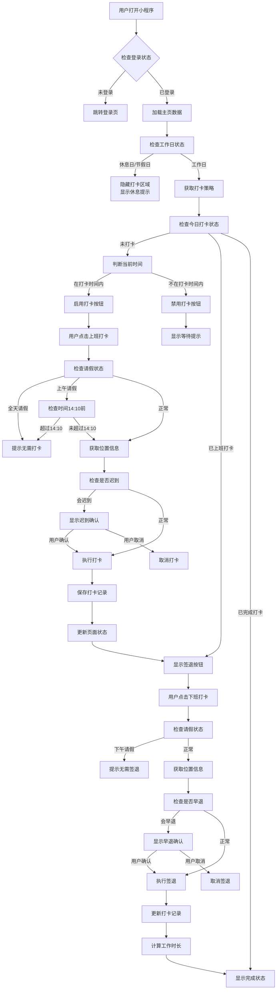
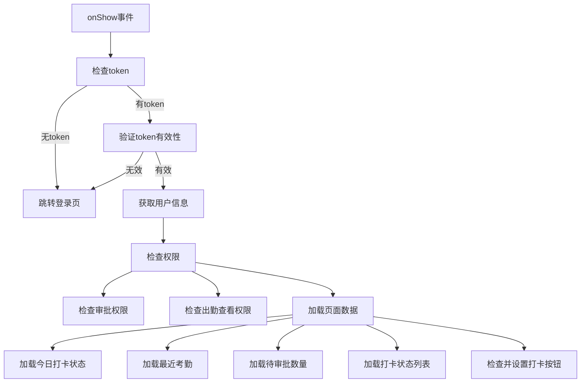
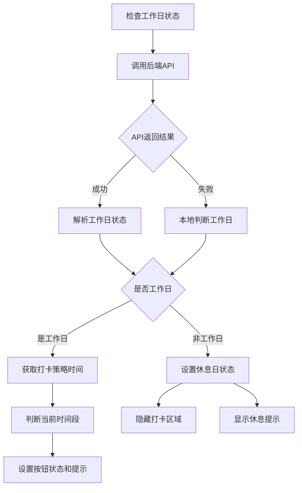
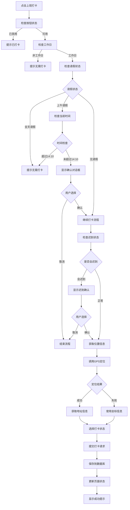
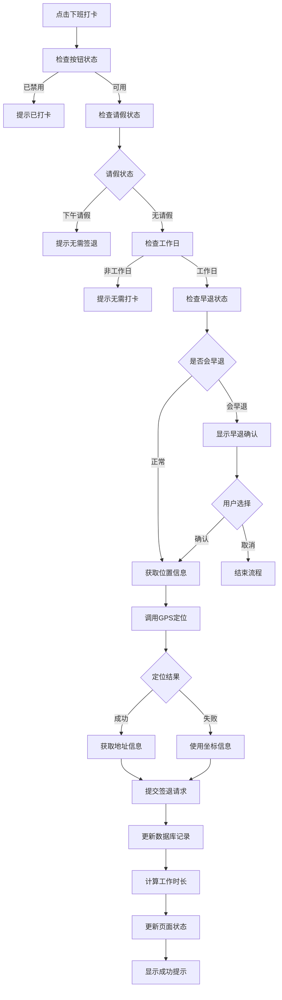
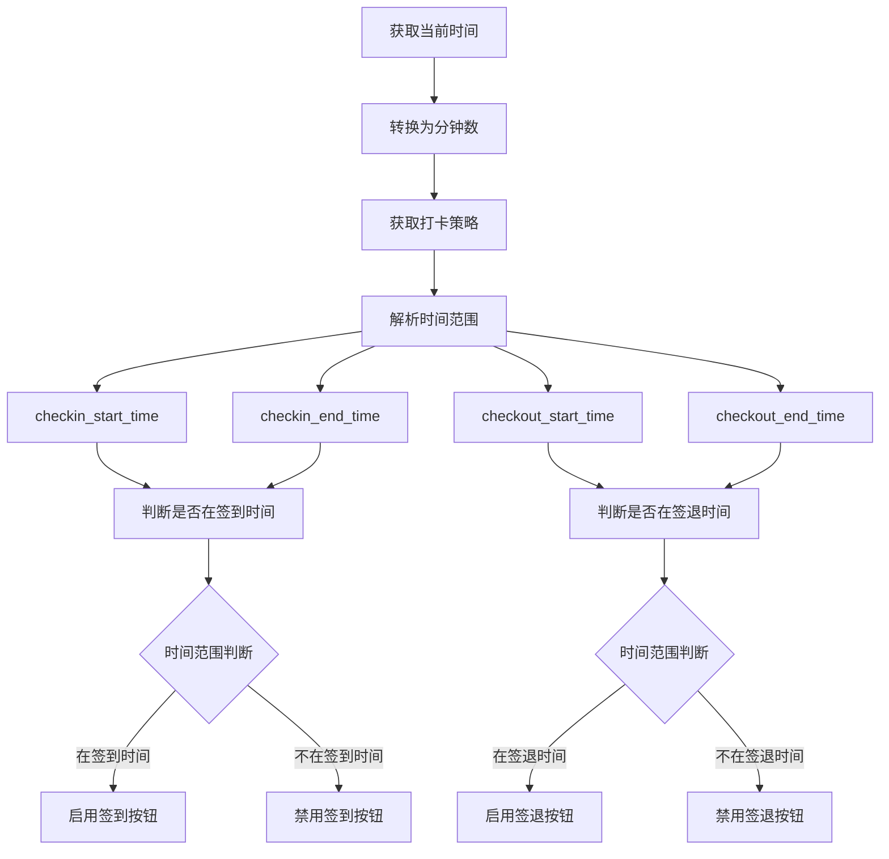
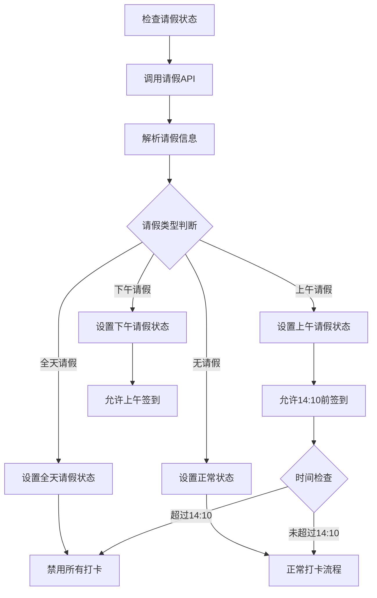
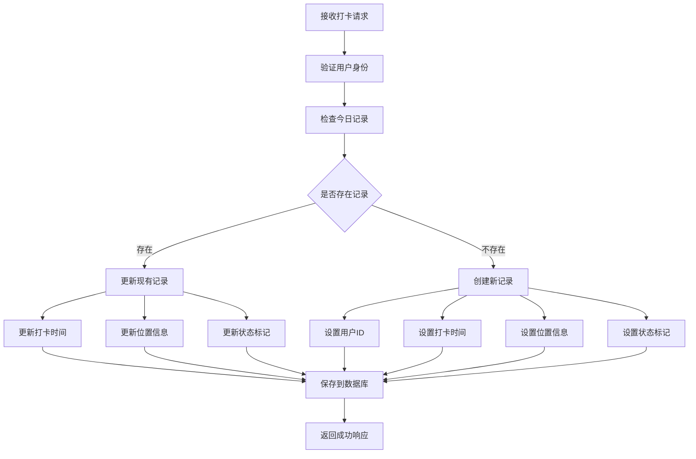
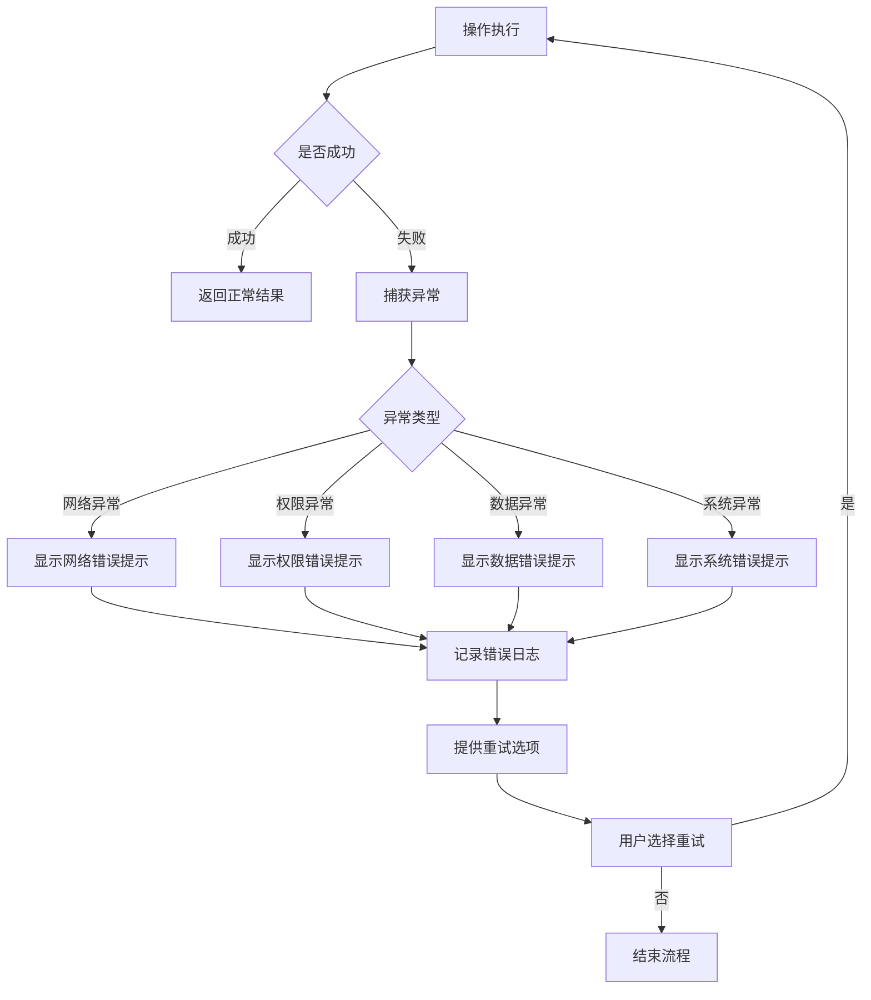

# 签到打卡系统流程图

## 系统整体架构流程

## 详细业务逻辑流程

### 1. 页面初始化流程

### 2. 工作日检查流程

### 3. 上班打卡详细流程

### 4. 下班打卡详细流程

### 5. 时间判断逻辑流程

### 6. 请假状态检查流程

## 数据库操作流程

### 打卡记录保存流程

## 异常处理流程

## 关键业务规则

1. **时间规则**
   - 上班打卡时间：08:00-11:30（可配置）
   - 下班打卡时间：17:20-20:00（可配置）
   - 上午请假14:10前可签到
   - 迟到阈值：可配置分钟数

2. **状态规则**
   - 正常签到、市区办事、出差三种状态
   - 迟到、早退自动标记
   - 请假状态优先级最高

3. **权限规则**
   - 必须登录才能打卡
   - 工作日才能打卡
   - 请假状态限制打卡

4. **数据规则**
   - 每天只能有一次上班打卡
   - 必须先上班打卡才能下班打卡
   - 位置信息可选，失败不影响打卡